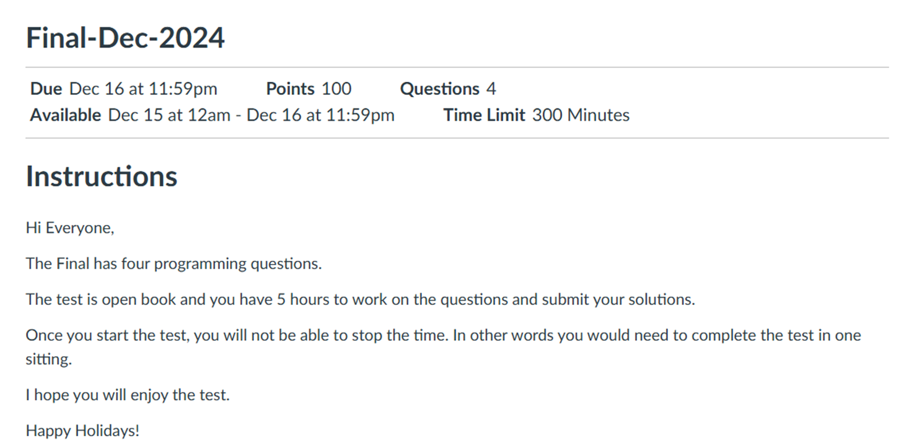
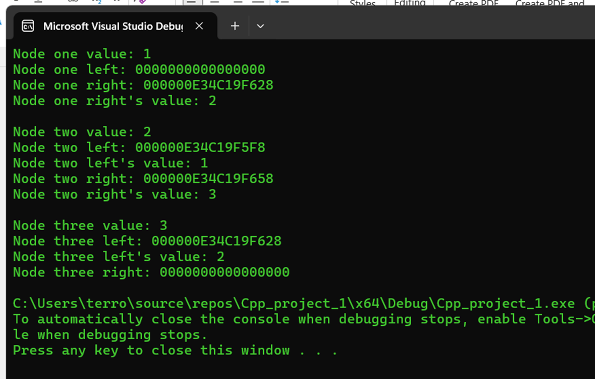
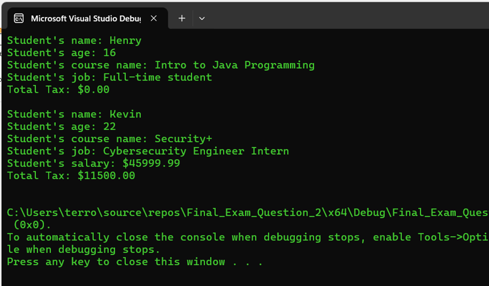
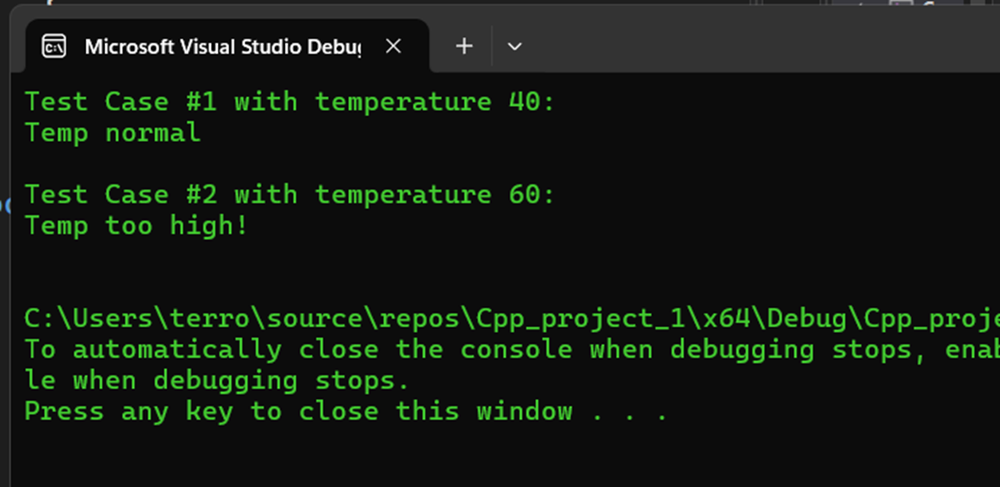
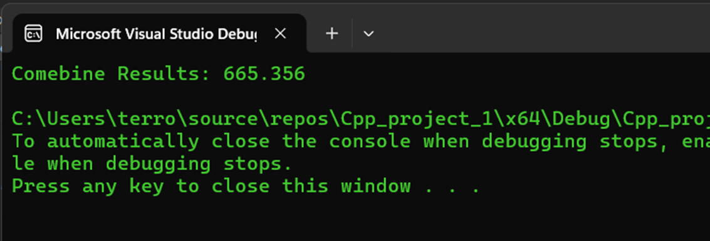
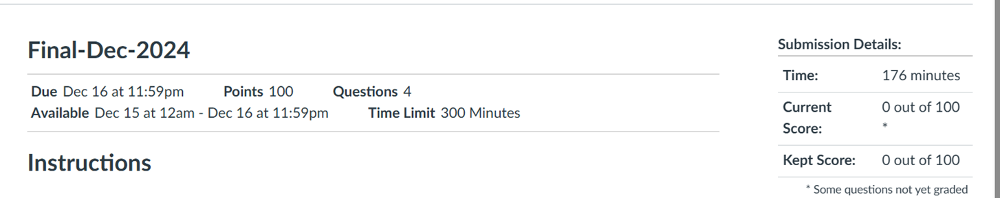
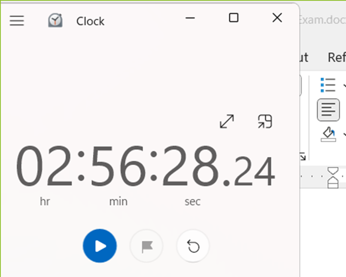

 

  

# Final Exam Projects

# 1. Introduction + Prompt:

## ✨ Question 1:
1.	Define a structure called Node, which has the following members:
> 1.	An int called value
> 2.	A pointer to a Node on its left
> 3.	A pointer to a Node on its right
2.	In the main, do the following:
> 1.	Create three nodes of type Node called nodes one, two, and three
>> 1.	For node one, the value is 1, the left pointer is null and the right pointer points to node two
>> 2.	For node two, the value is 2, the left pointer is points to node one and the right pointer points to node three
>> 3.	For node three, the value is 3, the left pointer is points to node two and the right pointer is null
> 2.	print the values of all nodes

3.	 How to Submit your work:
> - Zip all the .cpp and .h files and submit the zip file here on Canvas.
> - Include the instructions on how to run your program.
> - If you use Visual Studio, please zip and submit the entire solution not just the .sln file (the .sln file does not include your code!)

### > Output:

## ✨ Question 2:
1.	Use inheritance to implement the following while avoiding duplication:
> 1.	A person has a name and age 
> 2.	A student has a name, age and a course name
> 3.	A par-time student has a name, age, a course name, a job and a salary
2.	Add constructor methods to each class that receive the values of their instance variables as parameters and initialize them.
3.	Make the person class abstract by adding the following pure virtual method to it:
> 1.	calculateTax()
> 2.	implement the above method in each of the subclasses. 
> 3.	the amount of calculated tax is as follows:
>> 1.	if student does not have income, taxes will be zero
>> 2.	if student has a salary, taxes will be 25% of their income.
4.	Write a main() method that does the following:
>> 1.	Creates an instance of each class and assigns values to each object instance variables.
>> 2.	Calls all methods available to each class that return values and prints their results.

5.	 How to Submit your work:
> - Zip all the .cpp and .h files and submit the zip file here on Canvas.
> - Include the instructions on how to run your program.
> - If you use Visual Studio, please zip and submit the entire solution not just the .sln file (the .sln file does not include your code!)
Note: make necessary assumptions about the types of the instance variables in each class.

### > Output:

## ✨ Question 3:
1.	Write a function that throws an exception of type string when temperature is higher than 50 degrees other wise returns true. The exception string text says "Temp too high!". Function receives the temperature as a parameter. Choose a name for your function.

2.	In main, catch the exception and print its text. If there is no exception and the return value is true, print "Temp normal"
3.	 How to Submit your work:
> - Zip all the .cpp and .h files and submit the zip file here on Canvas.
> - Include the instructions on how to run your program.
> - If you use Visual Studio, please zip and submit the entire solution not just the .sln file (the .sln file does not include your code!)

### > Output:

## ✨ Question 4:
Convert the following function to a function template:
double combineResults(int val1, double val2)
{
    int tmpVal1;
    double tmpVal2;
    tmpVal1 = val1;
    tmpVal2 = val2;
    for (int i = 1; i < 10; i++){
        tmpVal1 += i;
        tmpVal2 += (5.1 * i);
    }
    return (tmpVal1 + tmpVal2);
}
 How to Submit your work:
> - Zip all the .cpp and .h files and submit the zip file here on Canvas.
> - If you use Visual Studio, please zip and submit the entire solution not just the .sln file (the .sln file does not include your code!)

### > Output:

# 2. Total Time Completed:

