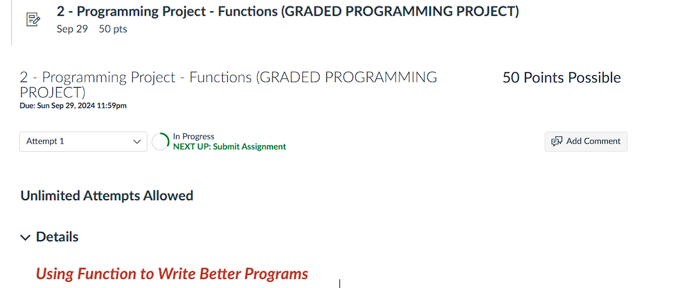

 


<br><br>


# Module Week 6_2 Programming Project

# 1. Introduction + Prompt:

> In this project you will practice using functions to divide the entire program into different modules. This will make your program more readable and easier to maintain. Please follow the steps below to develop and submit your program. You may use Visual Studio or other IDE's to develop your program.

> 1 - Write a function, called getValue, that asks the user to enter an integer on the keyboard and returns the entered value.
The function prototype is:
int getValue(); 

```cpp
int getValue();

int getValue() {
	int num;
	cout << "Please enter an integer on the keyboard: " << endl;
	cin >> num;
	return num;
}
```

> 2 - Write a function, called isEven, that receives an integer and returns a boolean. This function returns true if the given value is an even number otherwise false. You may use the modulo operation to find out whether an integer is even or odd.
The function prototype is:
```cpp
bool isEven( int); 
```
```cpp
bool isEven(int);


bool isEven(int num) {
	if (num % 2 == 0) {
	 	return true;
	}
	else {
	 	return false;
	}
}
```


> 3 - Write a function, called showResult, that receives a boolean and prints "The number you entered is even." if the boolean is true otherwise prints "The number you entered is odd".
The function prototype is:
```cpp
void showResult(bool); 
```
```cpp
void showResult(bool);

void showResult(bool isEven) {
	if (isEven == true) {
		cout << "The number you entered is even." << endl;
	}
	else {
		cout << "The number you entered is odd." << endl;
	}
}
```

> 4 - In the main(), call the above functions in the order you developed them. You notice that the main() will mainly be consisting of three function calls.
```cpp
#include <iostream>
using namespace std;


int getValue();
bool isEven(int);
void showResult(bool);

int main() {
	showResult(isEven(getValue()));
	return 0;
}

int getValue() {
	int num;
	cout << "Please enter an integer on the keyboard: ";
	cin >> num;
	cout << endl;
	return num;
}

bool isEven(int getVal) {
	if (getVal % 2 == 0) {
		return true;
	}
	else {
		return false;
	}
}

void showResult(bool isEven) {
	if (isEven == true) {
		cout << "The number you entered is even." << endl;
	}
	else {
		cout << "The number you entered is odd." << endl;
	}
}
```
 
 
> How to Submit your work:
- Put all the functions in one cpp file and submit the file here on Canvas.
- Include the instructions on how to run your program.
- If you use Visual Studio, please zip and submit the entire solution.


# 2. Output:


