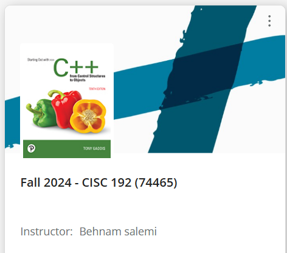
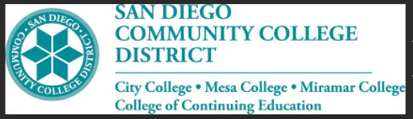
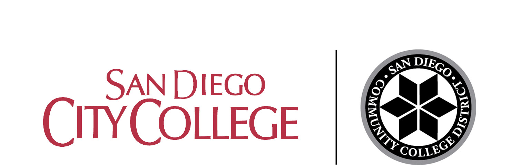
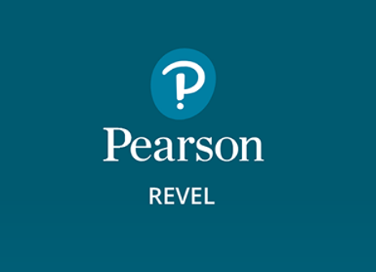
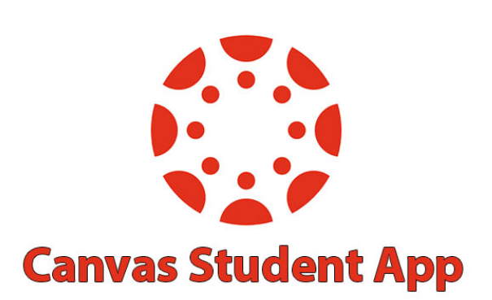

  

# 'CISC_192_college_class_projects' child repository of 'C_Plus_Plus_projects' repository contains all of the C++ projects from Computer Information Science 192: C/C++ Programming class at San Diego City College.

 

## ⚠️💻 This class uses the Pearson Revel Platform to help students study and work with C++ programming language 💻⚠️

## ❇️ All the projects include syntaxes that are written by me and my professor Behnam Salemi.❇️

  

# 2. College:

    

# 3. Platform:

 

