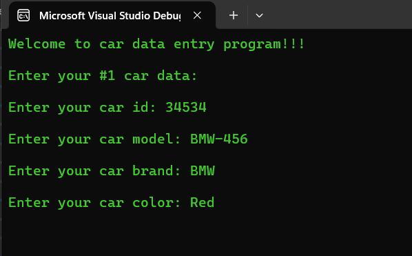
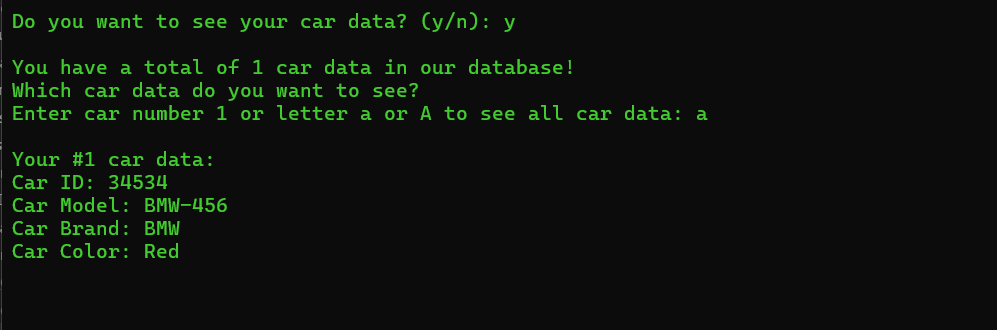
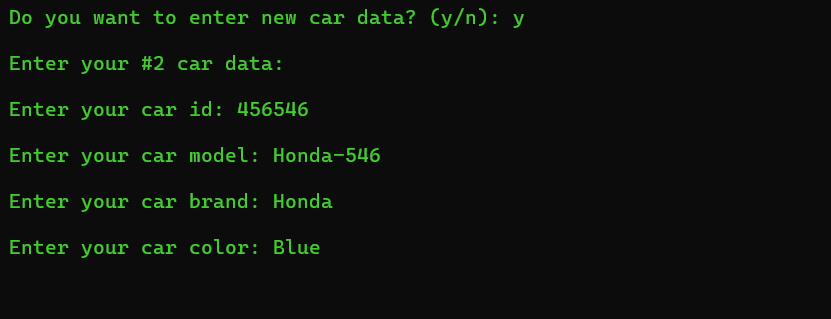
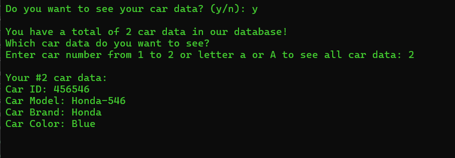
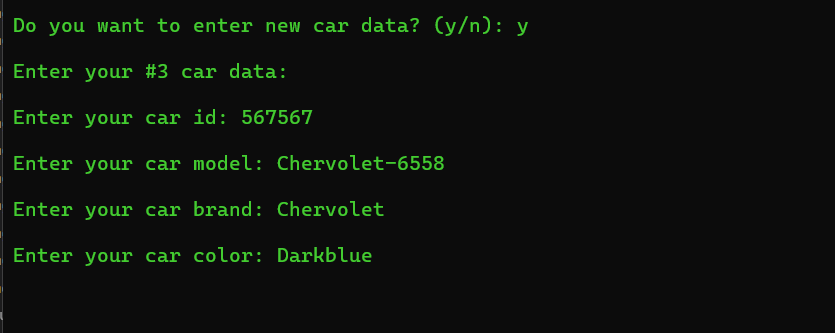
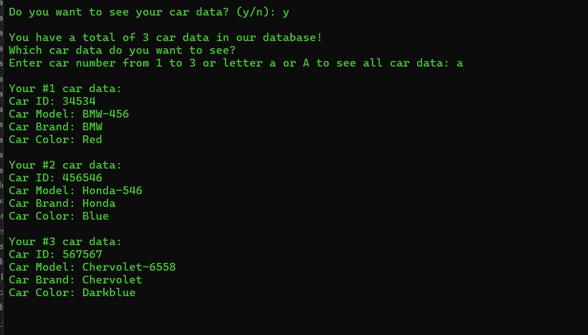
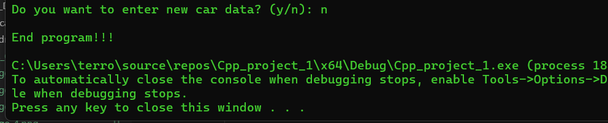

 

  

# Users Object Car Data

# 1. Introduction + Purpose:
> This project is use to learn how to deal with Classes and Objects in C++. 

> The project prompts user to enter the car data into command line interface, then display the car(s) information back to the user through different prompts.

# 2. Technologies:
### a. Programming languages:

### b. IDE, Software:

 

# 3. Output:

